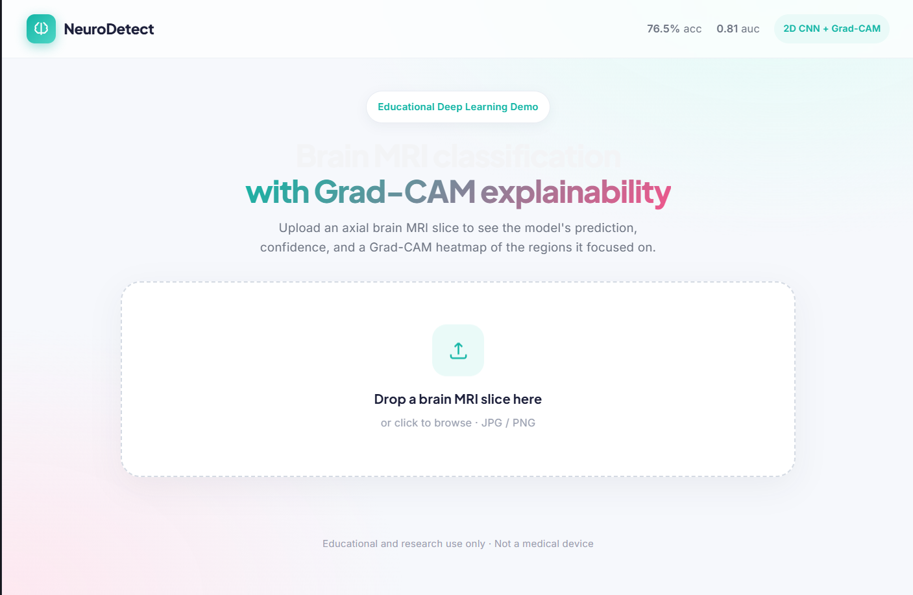

# Alzheimer's Detection from Brain MRI (2D CNN + Grad-CAM)

A full-stack deep learning project that detects Alzheimer's disease from brain MRI scans. It slices 3D MRI volumes into 2D images, classifies them with a convolutional neural network, explains predictions with Grad-CAM, and serves the model through an interactive React + FastAPI web app.

This project is as much about **rigorous, honest evaluation** as it is about the model. Two issues that commonly inflate medical-imaging results — patient-level data leakage and overfitting — were identified and addressed here, and the numbers reported are the corrected, honest ones.



---

## Table of Contents

- [Overview](#overview)
- [Results](#results)
- [Reading These Results Honestly](#reading-these-results-honestly)
- [How It Works](#how-it-works)
- [Model Architecture](#model-architecture)
- [Interactive Dashboard](#interactive-dashboard-react--fastapi)
- [Dataset](#dataset)
- [Project Structure](#project-structure)
- [Getting Started](#getting-started)
- [Tech Stack](#tech-stack)
- [Limitations and Next Steps](#limitations-and-next-steps)
- [Disclaimer](#disclaimer)
- [License](#license)

---

## Overview

Alzheimer's disease produces subtle, diffuse structural changes in the brain (atrophy, enlarged ventricles) rather than a single discrete lesion. This makes it a genuinely hard classification target from MRI — far harder than detecting a visible tumor mass.

This project:

1. Converts 3D MRI volumes into 2D axial slices and classifies each slice as Normal or Alzheimer's.
2. Splits the data **by patient** so the model is evaluated on people it has never seen.
3. Applies regularization (augmentation, dropout, weight decay, early stopping) to reduce overfitting.
4. Explains predictions with Grad-CAM and serves everything through a web app.
5. Reports honest metrics, including a clear-eyed account of where the model is weak.

---

## Results

Evaluated on a **patient-held-out validation set** — no patient appears in both training and validation.

| Metric | Score |
| ------ | ----- |
| Accuracy | **76.5%** |
| ROC-AUC | **0.81** |
| Sensitivity (Alzheimer's recall) | 0.38 |
| Specificity (Normal recall) | 0.91 |

Per-class performance:

| Class | Precision | Recall | F1 | Support |
| ----- | --------- | ------ | -- | ------- |
| Alzheimer's | 0.596 | 0.380 | 0.464 | 736 |
| Normal | 0.800 | 0.906 | 0.850 | 2,016 |

Confusion matrix (rows = true, cols = predicted):

|              | Pred Alzheimer's | Pred Normal |
| ------------ | ---------------- | ----------- |
| **True Alzheimer's** | 280 | 456 |
| **True Normal**      | 190 | 1826 |

---

## Reading These Results Honestly

This project went through two rounds of correction. The numbers above reflect the *true* difficulty of the task rather than an inflated headline.

**1. Patient-level data leakage (fixed).**
An early version split the data by individual slice. Because many slices come from the same patient, slices from one brain leaked into both training and validation — letting the model recognize patients rather than disease, and inflating accuracy. The pipeline now splits strictly **by patient** using `GroupShuffleSplit` on patient IDs, with an assertion guaranteeing zero patient overlap. Every number here is on this clean split.

**2. Overfitting (reduced).**
After fixing the leak, the model overfit heavily — training loss collapsed toward zero while validation accuracy stalled. Adding data augmentation, dropout, weight decay, and early stopping improved generalization and raised ROC-AUC from 0.76 to **0.81**.

**3. The remaining limitation — low sensitivity.**
The model favors specificity (0.91) over sensitivity (0.38): it reliably identifies healthy scans but misses many Alzheimer's cases. For a screening application — where catching disease is the priority and a false negative is the costly error — this operating point is the main weakness. The model clearly has discriminative signal (AUC 0.81), but its current decision threshold and class balance push predictions toward "Normal." Shifting this tradeoff is the top next step.

**Why this task is hard.**
Alzheimer's presents as subtle, diffuse atrophy rather than a discrete lesion, and the OASIS-1 cohort includes many very mild (CDR 0.5) cases that are genuinely difficult to distinguish on a single 2D slice. An honest ~76% accuracy / 0.81 AUC is consistent with the difficulty of single-slice classification on this dataset; reported scores far above this often stem from the very patient leakage corrected here.

---

## How It Works

1. **Slice extraction** — each 3D MRI volume is sliced along the axial plane into 2D images.
2. **Preprocessing** — slices are converted to single-channel grayscale, resized to 128×128, and (for training only) augmented with horizontal flips, small rotations, slight translations, and brightness/contrast jitter.
3. **Patient-level split** — slices are grouped by patient ID and split by patient so no individual appears in both training and validation.
4. **Classification** — a 2D CNN classifies each slice as Normal or Alzheimer's.
5. **Regularized training** — Adam with weight decay, dropout in the classifier, class weighting for imbalance, and early stopping on validation accuracy.
6. **Explainability** — Grad-CAM on the final convolutional block highlights the regions driving each prediction.
7. **Serving** — a FastAPI backend runs inference and Grad-CAM; a React frontend provides the interactive UI.

### Preventing patient leakage

Slices from a single patient are highly correlated. If they appear in both training and validation, the model can recognize the patient instead of the disease. The data loader derives a patient ID from each slice's folder (e.g. `OAS1_0001_MR1` → `OAS1_0001`) and splits by patient with `GroupShuffleSplit`, asserting zero overlap.

---

## Model Architecture

A compact 2D CNN (`Alzheimer2DCNN`):

- **Feature extractor:** four convolutional blocks (Conv → BatchNorm → ReLU) with max-pooling between blocks and adaptive max-pooling to a fixed 7×7 output. Channels grow 1 → 32 → 64 → 128 → 256.
- **Classifier:** Flatten → Dropout(0.3) → Linear(256·7·7 → 512) → ReLU → Dropout(0.5) → Linear(512 → 2).
- **Input:** 128 × 128 single-channel MRI slice.
- **Output:** two class logits (Alzheimer's / Normal).

Dropout in the classifier, plus weight decay and augmentation in training, are the main defenses against overfitting.

---

## Interactive Dashboard (React + FastAPI)

A web app runs the trained model end to end. Upload a brain MRI slice and the app returns the prediction, per-class confidence, and a Grad-CAM heatmap showing the regions the model focused on.

**Architecture:** a React (Vite) frontend sends the uploaded image to a FastAPI backend, which preprocesses it with the same transforms used in training, runs the model and Grad-CAM, and returns the prediction, probabilities, and heatmap as JSON.

```
React (Vite)  --POST /predict-->  FastAPI  -->  Alzheimer2DCNN + Grad-CAM
   frontend     (multipart image)   backend        (inference + heatmap)
       <------------ JSON: prediction, probabilities, images ------------
```

> Note: the model was trained on axial slices, so axial views give the most reliable predictions. As described in the results, the model favors specificity over sensitivity — it identifies healthy scans more reliably than it catches Alzheimer's cases.

---

## Dataset

- **Source:** OASIS-1 (Open Access Series of Imaging Studies)
- **Type:** 3D brain MRI, sliced into 2D axial images
- **Classes:** Alzheimer's (folder `0`) and Normal (folder `1`)
- **Class balance:** ~135 Alzheimer's vs ~301 Normal patients (imbalanced toward Normal)
- **Split:** by patient, ~80/20 train/validation, zero patient overlap

Medical data is **not** included in this repository for ethical and legal reasons. The pipeline expects OASIS data placed under `dataset/OASIS1/processed/slices/`, with `0/` and `1/` class folders, each containing per-patient subfolders of slices.

---

## Project Structure

```
alzheimers-mri-detection/
├── assets/                       # dashboard screenshot, Grad-CAM images
├── dataset/OASIS1/               # MRI data (not committed)
│   └── processed/slices/         # 0/<patient>/*.png, 1/<patient>/*.png
├── saved_models/                 # trained checkpoints (not committed)
├── frontend/                     # React (Vite) dashboard
│   └── src/App.jsx
├── src/
│   ├── model/
│   │   └── model_2d_cnn.py       # Alzheimer2DCNN architecture
│   ├── training/
│   │   ├── utils.py              # patient-split dataloaders + augmentation
│   │   ├── train.py              # regularized training loop
│   │   └── evaluate.py           # held-out evaluation + metrics
│   └── api.py                    # FastAPI backend (inference + Grad-CAM)
├── requirements.txt
├── .gitignore
└── README.md
```

---

## Getting Started

### Prerequisites

- Python 3.10+
- Node.js 18+ (for the dashboard frontend)
- OASIS-1 MRI data, sliced and placed under `dataset/OASIS1/processed/slices/`

### 1. Set up and train

```bash
git clone https://github.com/lost-cupcake/alzheimers-mri-detection.git
cd alzheimers-mri-detection

python -m venv venv
venv\Scripts\activate          # Windows
# source venv/bin/activate     # macOS / Linux

pip install -r requirements.txt
python -m src.training.train
```

The loader prints a split summary confirming zero patient overlap, e.g.
`[split] train: 332 patients / 11200 slices | val: 84 patients / 2752 slices | overlap: 0`

### 2. Evaluate

```bash
python -m src.training.evaluate
```

Prints the confusion matrix, per-class precision/recall, sensitivity, specificity, and ROC-AUC.

### 3. Run the dashboard

Backend (from the project root):

```bash
python -m src.api          # serves on http://127.0.0.1:8000
```

Frontend (in a second terminal):

```bash
cd frontend
npm install
npm run dev                # serves on http://localhost:5173
```

Open http://localhost:5173 and upload an MRI slice. Both servers must be running.

---

## Tech Stack

| Layer | Technology |
| ----- | ---------- |
| Deep learning | PyTorch |
| Data / metrics / splitting | torchvision, scikit-learn, NumPy |
| Explainability | Grad-CAM |
| Backend | FastAPI, Uvicorn |
| Frontend | React, Vite |
| Visualization | Matplotlib, PIL |

---

## Limitations and Next Steps

- **Low sensitivity (0.38)** — the priority for a screening tool. Threshold tuning, class rebalancing, or focal loss could shift the operating point toward catching more Alzheimer's cases (at some cost to specificity).
- **2D single-slice modeling** — Alzheimer's atrophy is a 3D pattern; a 3D CNN would capture volumetric structure but is computationally prohibitive without GPU resources, so it remains future work.
- **Patient-level metrics** — slice predictions could be aggregated into a single per-patient diagnosis (mean probability / majority vote) and reported at the patient level.
- **Calibration and uncertainty** — probability calibration and uncertainty estimates would make per-patient decisions more trustworthy.
- **Larger / multi-cohort data** — adding cohorts (e.g. OASIS-2/3) could help, but requires careful handling of cross-dataset distribution shift and patient-level grouping to avoid reintroducing leakage.

---

## Disclaimer

This project is for **educational and research purposes only**. It is **not** a medical device and must **not** be used for clinical diagnosis or treatment decisions.

---

## License

Released under the MIT License.
